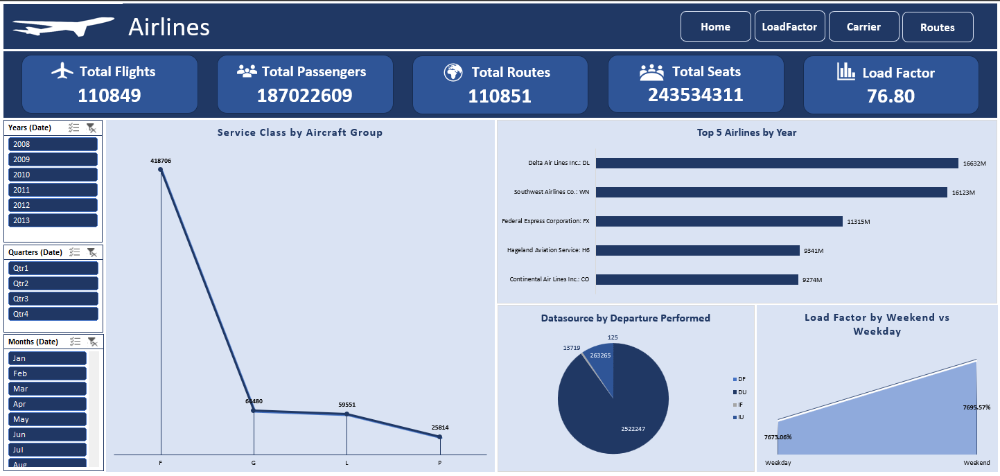
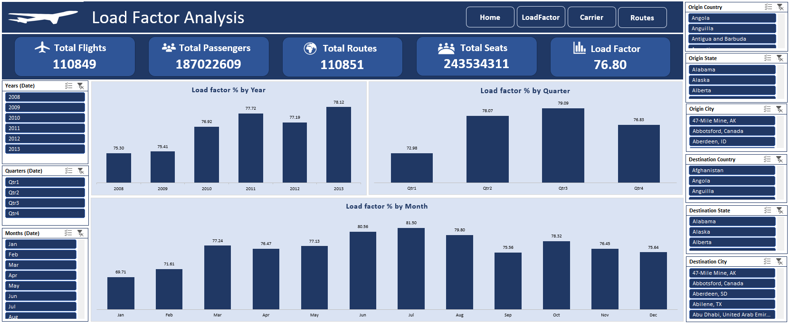
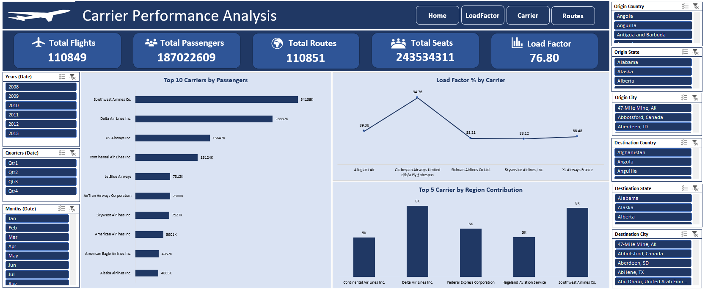
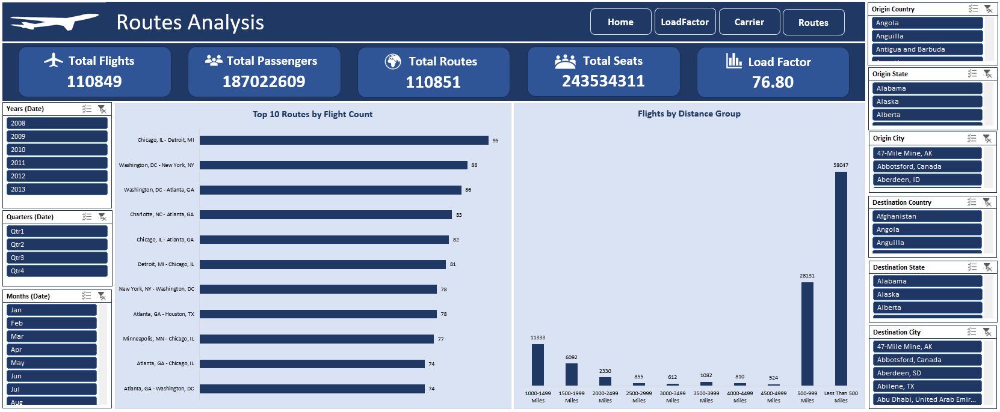

# 🛫 Airlines – Excel Dashboard Project

## 📊 Project Overview
**Airlines** Dashboard is an advanced Excel-based business intelligence project developed during an internship.  
The project analyzes airline performance metrics such as **Load Factor**, **Passenger Trends**, and **Carrier Efficiency**, transforming raw flight data into actionable insights using **Pivot Tables, Power Query, and interactive dashboard design**.

---

## 🧠 Objectives
- Merge and clean multiple datasets using **Power Query**
- Create derived columns: Date, Month, Quarter, Weekday, Weekend, Distance Group
- Calculate KPIs:
  - Total Flights
  - Total Passengers
  - Load Factor %
  - Top 10 Carriers
  - Top Routes
  - Weekend vs Weekday performance
- Build a **multi-page Excel dashboard** with slicers, charts, and navigation bar

---

## 🖥️ Dashboard Preview  








---

## 🗂️ Dataset Description
| File Name | Description |
|------------|-------------|
| `MainData_Final.xlsx` | Main merged dataset |
| `Aircraft Groups.xlsx` | Aircraft group details |
| `Aircraft Types.xlsx` | Aircraft type details |
| `Airlines.xlsx` | Airline names and IDs |
| `Carrier Groups.xlsx` | Carrier group categories |
| `Carrier Operating Region.xlsx` | Regional codes |
| `Destination Markets.xlsx` | Destination airport markets |
| `Origin Markets.xlsx` | Origin airport markets |
| `Distance Groups.xlsx` | Distance ranges |
| `Flight Types.xlsx` | Flight type classification |

All data sources were merged into a single table using **Power Query (VLOOKUP alternative)**.

---

## ⚙️ Data Preparation Workflow
1. **Data Cleaning:** Removed blanks, ensured data consistency.
2. **Data Merging:** Combined all dimension tables with the main dataset.
3. **Date Creation:**  
   ```excel
   =DATE([@Year],[@Month],[@Day])

---

## 📈 Key Performance Indicators (KPIs)
| KPI                           | Description                     |
| ----------------------------- | ------------------------------- |
| ✈️ **Total Flights**          | Total flight records            |
| 👥 **Total Passengers**       | Sum of transported passengers   |
| 🌍 **Top Routes**             | Based on flight frequency       |
| 🏢 **Total Seats**            | Based on passenger count        |
| 📊 **Load Factor %**          | Passenger capacity utilization  |


---

## 🖥️ Dashboard Features
- Power Query-based Data Model
- Dynamic Slicers – Year, Quarter, Month, Carrier, Route
- Navigation Bar for multi-page experience
- KPI Cards with icons and dynamic metrics
- Consistent color theme and layout
- Auto-updating Load Factor % field

---

## 🧩 Excel Tools & Formulas Used
- Functions: DATE(), TEXT(), WEEKDAY(), IF(), ROUNDUP()
- PivotTables: To summarize and group KPIs
- PivotCharts: To visualize trends
- Slicers: For interactive filtering
- Conditional Formatting: To highlight insights
- Power Query: For merging 10+ datasets

---

## 🎨 Design & Layout
- Color Palette: Sky Blue, Navy Blue, and White
- Theme: Minimal, professional, and data-focused
- Icons: Used for KPIs (flights, passengers, routes, etc.)
- Navigation: Button-based sheet navigation (Home → Analysis → Insights)

---

## 🧾 Business Insights
- The Load Factor % shows strong yearly growth.
- Top carriers consistently achieve higher efficiency.
- Weekdays have higher occupancy than weekends.
- Medium-distance routes (500–1500 miles) are most frequent.
- Top 10 routes account for a major share of passenger traffic.

---

## 🏁 Outcome
- Built a professional-level Excel dashboard simulating a real-world airline analytics report.
- Strengthened expertise in Excel, Power Query, and storytelling with data.
- Delivered actionable insights with interactive navigation and clean visuals.

---

## ⭐ How to Use
1. Download the Excel file from this repository.
2. Open in Excel and enable macros (if navigation uses VBA).
3. Use slicers to filter by Year, Carrier, Route, etc.
4. Navigate between pages using the Navigation Bar at the top.

---

## 🧰 Tools Used
- Microsoft Excel (2021 or later)
- Power Query
- PivotTables & PivotCharts
- Excel Formulas
- VBA (optional, for navigation)

---

## 👤 Author
**Shadan Tech**   
_Data Analyst_
🔗 [LinkedIn Profile](http://www.linkedin.com/in/shadantech)  
🔗 [Tableau Public Profile](https://public.tableau.com/app/profile/shadan.sarfaraz/vizzes)
🔗 [Newsletter](https://shadantech.substack.com/)

---

## ⭐ Show Your Support

If you found this project insightful, give it a **⭐ Star** on GitHub — it helps others discover it too!  
Connect on **LinkedIn** for more Power BI, Tableau, and Data Analytics projects.